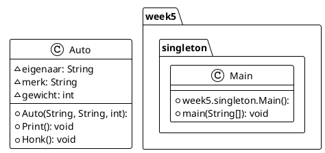
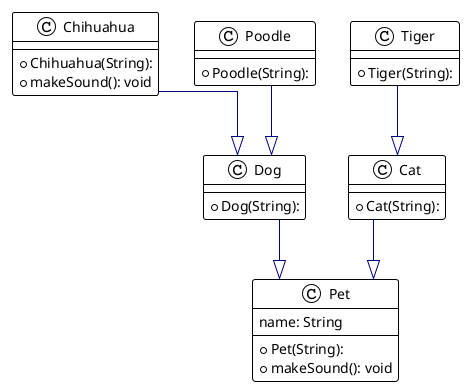

# Readme voor week 2

## Assignment 1
The diagram below shows how the classes in the code i wrote functions. 
It's a simple class of a car with some values. 
It has a constructer so all values have to be filled in, 
and has 2 functions Print() which prints some information about the car, 
and Honk() which prints out a string of a honk
## Car Diagram

## Assignment 2
Below here you can see the relation between all the classes.
They are all subclasses of the class pet and inherit the 'name' string and 
the makeSound() function. Some classes split into more subclasses 
which then in turn inherit more values from those classes 
for example Poodle inherits the value for sound used 
in the function makeSound() being "Woof".

These are all used in the code to display a sort of mini show for pets. 
Where they all get called out with their names 
and make their respective makeSound() sound
## Pet Diagram

## Object Oriented Programming
Objecten (dingen uit de werkelijkheid)
* Eigenschappen
* Functionaliteit

Objecten hebben interactie met elkaar om problemen op te lossen

Voordelen:
* Zorgt voor **structuur** in je programma wat helpt met het onderhouden van je applicatie
* Gelijkenis met werkelijkheid
* Hergebruik van objecten in andere programma's

Nadelen:
* OOP programma's kunnen trager zijn en gebruiken meer geheugen
* Te diep kunnen gaan in abstractie
* Het bouwen van OOP applicaties kan langer duren

OOB is geen programeertaal maar een programmeerparadigma
Een class is eigenlijk de groepering objecten.

3 Componenten maken een class:
* Naam "Wat is het?" (Een waterfles)
* Eigenschappen "Wat zijn kenmerken?" (Kleur, merk, inhoud, ...)
* Gedrag "Wat kan je ermee?" (Drinken, vullen, recyclen, ...)