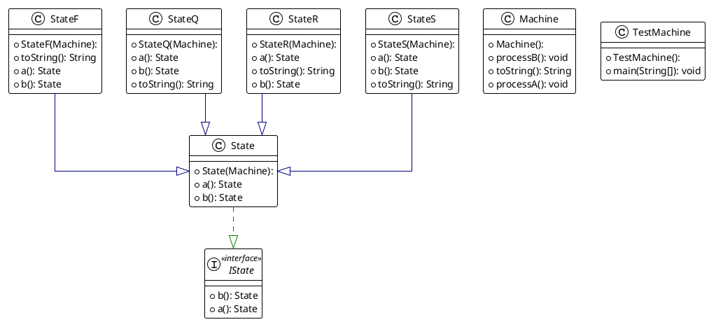
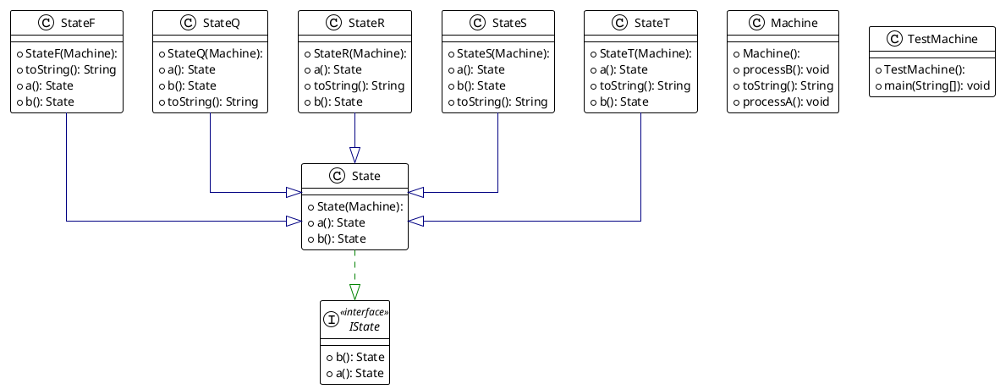

# Dit is de readme voor week 4
Het verschil tussen een Interface en een superklasse is dat een interface altijd
abstract is en geen body nodig heeft. Als jij bijvoorbeeld states wilt returnen
zou je met een super klasse een return null moeten geven omdat er een  body moet zijn.
Dit hoeft niet bij de interface.

Hier is de plantuml te zien van mijn statemachine ik heb meteen
een interface gebruikt met daarnaast nog een super klasse die functie mee kan geven
dit zorgt voor minder herhaling van code in de verschillende states. Ik vind dit persoonlijk
ook overzichtelijker

Hier zie je de plantuml van mijn statemachine met state T toegevoegd ik heb gekozen om hem tussen
state R en S te stoppen zodat er minder code veranderd moest worden

State T toevoegen was aardig simpel naast een paar kleine veranderingen
